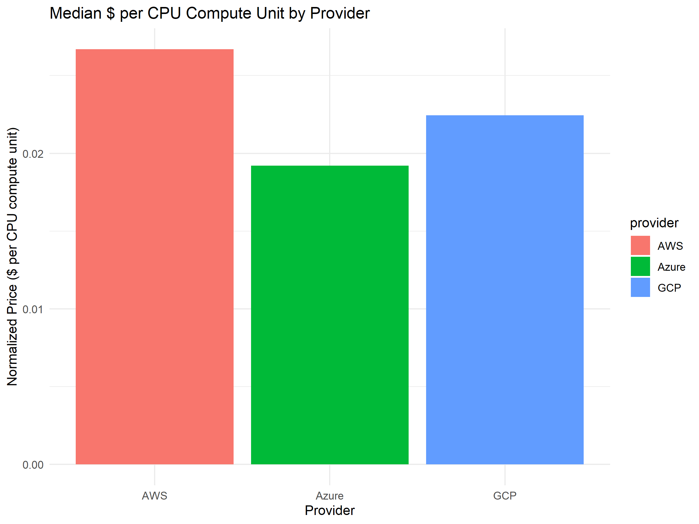
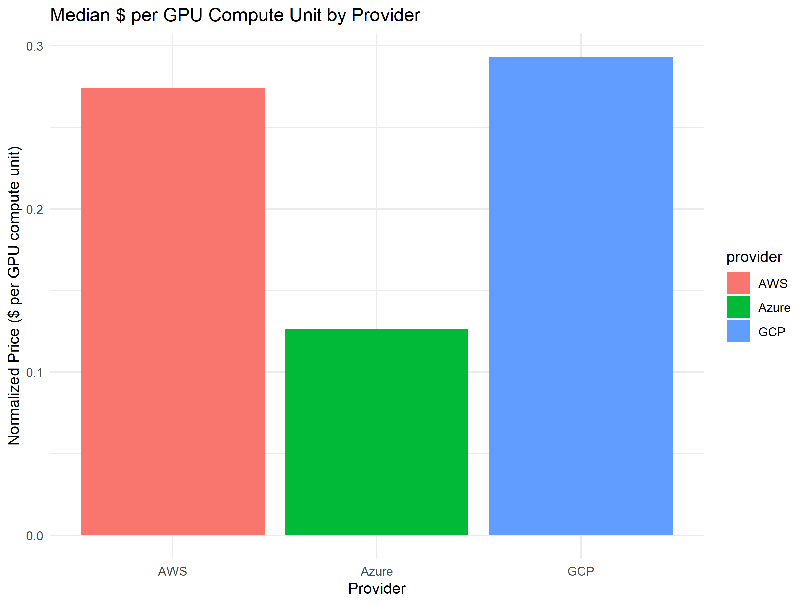

---
title: "Cloud VM Instance Price Analysis Report"
author: "Mithran Mohanraj"
date: "`r Sys.Date()`"
output: github_document
---

## Introduction

This report provides an analysis of cloud instance prices based on CPU and GPU compute units. The data covers various cloud instance details from multiple providers, allowing for a robust comparison of cost-efficiency.

## Methodology

### Data Loading and Preprocessing
The analysis begins by reading a merged CSV file (`pl_output/merged_data.csv`) and converting the `timestamp` column to a standard date-time format. Numerical columns (such as `vcpus` and `memory_gib`) are explicitly cast to numeric types to ensure correct computations.

### CPU Compute Unit Analysis
For CPU analysis, a compute score is defined as:

```
cpu_compute_score = vcpus + (memory_gib / 4)
```

The hourly price is then normalized by dividing by this compute score:

```
cpu_norm_price = price_per_hour / cpu_compute_score
```

Median values for the normalized CPU price are computed for each provider to allow a robust comparison across different offerings.

### GPU Compute Unit Analysis
For GPU analysis, instances with an unknown GPU model are filtered out. A lookup table assigns a score to each GPU model based on experimental benchmarks. The total GPU compute score is calculated as:

```
total_gpu_compute = gpu_score * gpu_count
```

The normalized GPU price is obtained by:

```
gpu_norm_price = price_per_hour / total_gpu_compute
```

Median values are then computed per provider to mitigate the impact of outliers.

## Results

### CPU Analysis
The bar plot below shows the median normalized CPU price per compute unit for each provider.



### GPU Analysis
The bar plot below shows the median normalized GPU price per compute unit for each provider.



## Conclusion

This analysis provides insights into the relative cost-efficiency of cloud instances. The differences in CPU and GPU compute unit pricing across providers can help inform decisions regarding cloud resource procurement.

