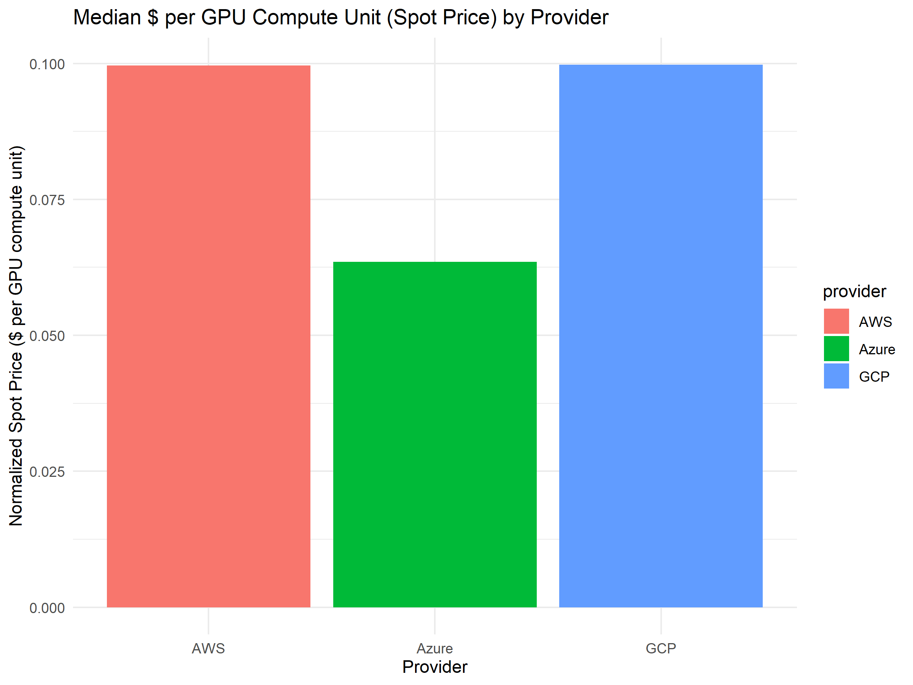
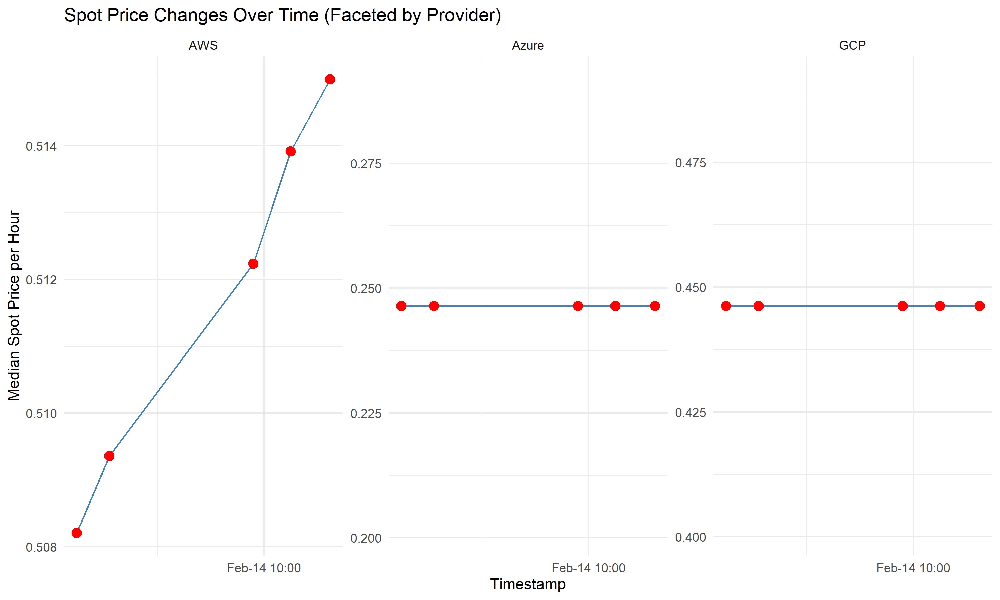

CloudGator Unified Analysis Report
================
Mithran Mohanraj
2025-02-14

# Introduction

This report attempts to evaluate the Spot Prices of VM Instances from
the big three clouds: AWS, Azure, and GCP. It combines outputs from
several analysis scripts:

1.  **Basic Analysis & Plots** (from `scripts/create_analysis.R`)
2.  **Central Tendency Summaries** (from `scripts/central_tendency.R`)
3.  **Statistical Tests** (from `scripts/kruskal_dunn_normalized.R`)

Below you will find the detailed outputs from each step.

------------------------------------------------------------------------

## 1. Basic Analysis & Plots

``` r
source("scripts/create_analysis.R")
```

    ## 
    ## Attaching package: 'dplyr'

    ## The following objects are masked from 'package:stats':
    ## 
    ##     filter, lag

    ## The following objects are masked from 'package:base':
    ## 
    ##     intersect, setdiff, setequal, union

    ## 
    ## Attaching package: 'lubridate'

    ## The following objects are masked from 'package:base':
    ## 
    ##     date, intersect, setdiff, union

    ## Running create_analysis.R...
    ## Rows: 23710 Columns: 13 
    ## 
    ## CPU-based Aggregated Spot Price Metrics:
    ## # A tibble: 3 × 4
    ##   provider median_cpu_spot_norm_price median_cpu_spot_price count
    ##   <chr>                         <dbl>                 <dbl> <int>
    ## 1 AWS                         0.00909                 0.511  4230
    ## 2 Azure                       0.00388                 0.246  4805
    ## 3 GCP                         0.00772                 0.446  5885

<!-- -->

    ## 
    ## GPU-based Aggregated Spot Price Metrics:
    ## # A tibble: 3 × 4
    ##   provider median_gpu_spot_norm_price median_gpu_spot_price count
    ##   <chr>                         <dbl>                 <dbl> <int>
    ## 1 AWS                          0.0996                 0.981   270
    ## 2 Azure                        0.0635                 0.636   120
    ## 3 GCP                          0.0998                 2.17    520

<!-- --><!-- -->

    ## 
    ## create_analysis.R completed.

------------------------------------------------------------------------

## 2. Central Tendency Summaries

``` r
source("scripts/central_tendency.R")
```

    ## Running central_tendency.R...
    ## 
    ## CPU Normalized Price Summary:
    ## # A tibble: 3 × 3
    ##   provider mean_cpu_norm median_cpu_norm
    ##   <chr>            <dbl>           <dbl>
    ## 1 AWS            0.0103          0.00909
    ## 2 Azure          0.00508         0.00388
    ## 3 GCP            0.00722         0.00772
    ## 
    ## GPU Normalized Price Summary:
    ## # A tibble: 3 × 3
    ##   provider mean_gpu_norm median_gpu_norm
    ##   <chr>            <dbl>           <dbl>
    ## 1 AWS              0.147          0.121 
    ## 2 Azure            0.194          0.0857
    ## 3 GCP              0.293          0.186 
    ## central_tendency.R completed.

------------------------------------------------------------------------

## 3. Statistical Tests (Kruskal-Wallis & Dunn)

``` r
source("scripts/kruskal_dunn_normalized.R")
```

    ## Running kruskal_dunn_normalized.R...
    ## 
    ## --- Kruskal-Wallis Test for CPU Normalized Spot Price ---
    ## 
    ##  Kruskal-Wallis rank sum test
    ## 
    ## data:  cpu_spot_norm_price by provider
    ## Kruskal-Wallis chi-squared = 5916.3, df = 2, p-value < 2.2e-16
    ## 
    ## 
    ## Significant differences found for CPU normalized prices. Running Dunn's test...
    ##   Kruskal-Wallis rank sum test
    ## 
    ## data: x and group
    ## Kruskal-Wallis chi-squared = 5916.014, df = 2, p-value = 0
    ## 
    ## 
    ##                            Comparison of x by group                            
    ##                                  (Bonferroni)                                  
    ## Col Mean-|
    ## Row Mean |        AWS      Azure
    ## ---------+----------------------
    ##    Azure |   74.73796
    ##          |    0.0000*
    ##          |
    ##      GCP |   25.52247  -52.91230
    ##          |    0.0000*    0.0000*
    ## 
    ## alpha = 0.05
    ## Reject Ho if p <= alpha/2
    ## $chi2
    ## [1] 5916.014
    ## 
    ## $Z
    ## [1]  74.73797  25.52248 -52.91231
    ## 
    ## $P
    ## [1]  0.000000e+00 5.550299e-144  0.000000e+00
    ## 
    ## $P.adjusted
    ## [1]  0.00000e+00 1.66509e-143  0.00000e+00
    ## 
    ## $comparisons
    ## [1] "AWS - Azure" "AWS - GCP"   "Azure - GCP"
    ## 
    ## 
    ## --- Kruskal-Wallis Test for GPU Normalized Spot Price ---
    ## 
    ##  Kruskal-Wallis rank sum test
    ## 
    ## data:  gpu_spot_norm_price by provider
    ## Kruskal-Wallis chi-squared = 67.736, df = 2, p-value = 1.956e-15
    ## 
    ## 
    ## Significant differences found for GPU normalized prices. Running Dunn's test...
    ##   Kruskal-Wallis rank sum test
    ## 
    ## data: x and group
    ## Kruskal-Wallis chi-squared = 67.7331, df = 2, p-value = 0
    ## 
    ## 
    ##                            Comparison of x by group                            
    ##                                  (Bonferroni)                                  
    ## Col Mean-|
    ## Row Mean |        AWS      Azure
    ## ---------+----------------------
    ##    Azure |   6.227247
    ##          |    0.0000*
    ##          |
    ##      GCP |  -1.549462  -8.187561
    ##          |     0.1819    0.0000*
    ## 
    ## alpha = 0.05
    ## Reject Ho if p <= alpha/2
    ## $chi2
    ## [1] 67.73312
    ## 
    ## $Z
    ## [1]  6.227248 -1.549462 -8.187562
    ## 
    ## $P
    ## [1] 2.373503e-10 6.063531e-02 1.332859e-16
    ## 
    ## $P.adjusted
    ## [1] 7.120508e-10 1.819059e-01 3.998578e-16
    ## 
    ## $comparisons
    ## [1] "AWS - Azure" "AWS - GCP"   "Azure - GCP"
    ## 
    ## kruskal_dunn_normalized.R completed.
